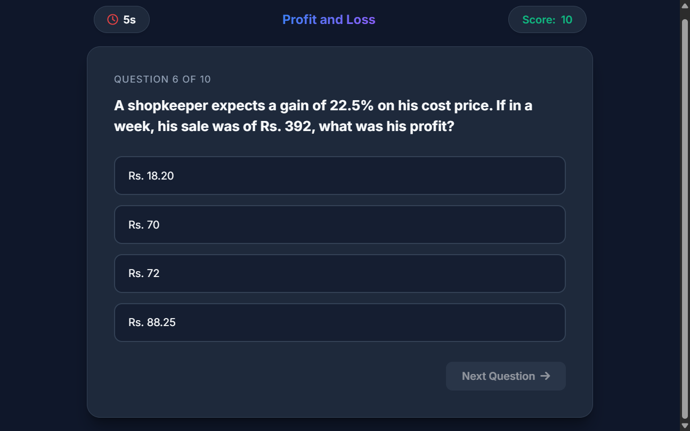

# QuizMaster App

A beautiful, responsive Single Page Application (SPA) Quiz App built with vanilla HTML, CSS, and JavaScript. The app allows users to test their knowledge across four different categories, tracking their time and score, and presenting a detailed summary of their performance.



## Features
- **Four Distinct Categories:** Choose between Pipes and Cisterns, Probability, Problems on Age, and Profit and Loss.
- **Dynamic 10-Second Timer:** A built-in timer adds pressure to each question. Time runs out? The answer is revealed automatically!
- **Real-Time Score Tracking:** Watch your score increment dynamically as you select the correct options.
- **Detailed Result Analytics:** A comprehensive Results dashboard tracks total time, attempts, right/wrong answers, and calculates your final percentage.
- **Sleek Dark Mode UI:** Premium aesthetics featuring glassmorphism elements, CSS variables, linear gradients, and responsive layout across mobile and desktop.

## Getting Started

Because it's a completely vanilla frontend project with no build tools needed, running it is incredibly simple.

1. Clone or download this repository.
2. Navigate to the project directory.
3. Open `index.html` directly in your favorite web browser or start a local HTTP server using:
   ```bash
   python -m http.server 8000
   ```
   or
   ```bash
   npx http-server
   ```
4. Enter your name and begin the quiz!

## Folder Structure

- `index.html`: The core HTML structure housing the Home, Quiz, and Result sections.
- `app.css`: The styling engine, containing CSS variables and the modern UI aesthetic.
- `app.js`: The application logic, State Management, and the JSON object storing all 40 questions.

Enjoy your ultimate Quiz Challenge!
